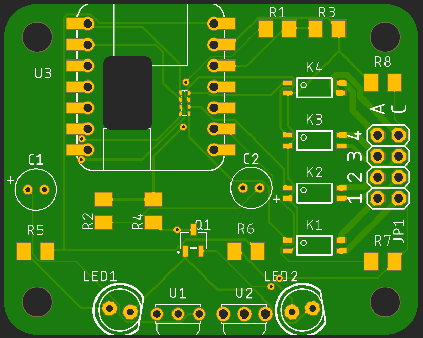
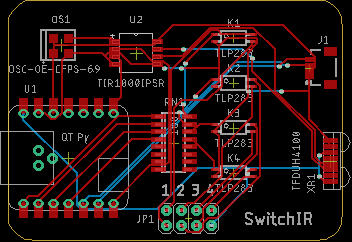

# The SwitchIR Project

## Introduction

Provides the ability to operate relays or send an IR signal in response to a signal received from:

* an IR Remote
* an IR Voice assistant
* a USB connected PC
* Wi-Fi
* or I2C (via Qwiic/STEMMA QT connector).

The use of an IR transceiver & encoder/decoder will allow the MCU to learn and transmit IR codes. The input channels are bi-directional as well allowing for an appropriate response to be returned.

## Status

|    Date    | Status                                                       |
| :--------: | ------------------------------------------------------------ |
| 2022-11-21 | Created a cutout for QT Py Flash memory. The boards are on almost here. |
| 2022-11-16 | The last part will arrived tomorrow. The board is fabbed and will arrive next week. |
| 2022-11-13 | Board updated, cleanup and updates pending. Board and parts orders pending. |
| 2022-11-06 | Adding ItsyBitsy into the mix.                               |
| 2022-11-04 | Success with IRLib2.                                         |
| 2022-11-03 | Moving from the IRDA hardware to something else. See below.  |
| 2022-11-01 | Replacement oscillators are on order (and more QT Pys and headers). |
| 2022-10-31 | Boards are in, (1) panel partially populated and under test. |
| 2022-10-29 | Parts are here, boards are on their way from China.          |
| 2022-10-26 | Rev 1b boards ordered. Order for passives is pending.        |
| 2022-10-25 | Reworking defective transceiver library part and added passives (finally). |
| 2022-10-25 | Rev 1a ~~boards and~~ parts have been ordered.               |

The full complement of Eagle and Gerber files (for PCB fabrication) will be provided after proof-of-concept.

### Testing Status:

**2022-11-04**

**Success** - finally. I'm running IRLib2 example programs dump.ino and analyze.ino after giving IRLib the option to invert the interpreted polarity of the input signal from the IR receiver.

**The attachInterrupt()) rabbit hole**: With no initial luck I tried passing interrupt 11 directly into attachInterrupt() instead of digitalPinToInterrupt(8). For the QT Py SAMD21 it turns out that attachInterrupt() calls macro digitalPinToInterrupt() expecting a enum EExt_Interrupts value. If you store the results of digitalPinToInterrupt(8) to an int, or use it as the interrupt parameter, you get 8, not interrupt 11. but if you call  attachInterrupt(11, ...) it converts it to interrupt 2 - not good. So there's a sneaky conversion between EExt_Interrupts  and int somewhere. Most of the time digitalPinToInterrupt() appears to do nothing until an EExt_Interrupts can be accepted. Anyway, that was an adventure with the Segger J-link debugger, Doxygen, and find | xargs | grep in the bowels of the Arduino board code, samd/\<ver>/cores/arduino/WVariant.h and WInterrupts.c may be of interest.

**... attachInterrupt() revisited ...** For **SAMD** all pins are interrupt capable so digdigitalPinToInterrupt() just returns the pin number. The conversion from pin to interrupt number occurs in attach/detachInterrupt with a pin descriptor table lookup.

**Anyway...** so finally I modified the IRLib2 code to allow me to indicate that the IR LED signal is inverted (my transceiver pulls the signal down when IR is present) and provided a global DIGTAL_READ() macro that can invert the polarity of digitalRead(), i.e., HIGH goes from MARK to SPACE. That allows dump.ino to spit out something like:

```
Decoded Unknown(0): Value:0 Adrs:0 (0 bits) 
Raw samples(100): Gap:57
  Head: m195  s75
0:m65511 s75	1:m65511 s75		 2:m65511 s75	3:m65511 s74		 
4:m65511 s75	5:m65511 s75		 6:m65511 s75	7:m65511 s75		 
8:m65511 s75	9:m65510 s75		 10:m65511 s75	11:m65511 s75		 
12:m65511 s75	13:m65511 s75		 14:m65510 s75	15:m65511 s75		 

16:m65511 s75	17:m65511 s75		 18:m65511 s75	19:m65510 s75		 
20:m65511 s75	21:m65511 s75		 22:m65511 s75	23:m572 s75		 
24:m65511 s75	25:m65511 s75		 26:m65511 s75	27:m65511 s74		 
28:m65511 s75	29:m65511 s75		 30:m65511 s75	31:m65511 s75		 

32:m65511 s75	33:m65510 s75		 34:m65511 s75	35:m65511 s75		 
36:m65511 s75	37:m65511 s75		 38:m65510 s75	39:m65511 s75		 
40:m65511 s75	41:m65511 s75		 42:m65511 s75	43:m65511 s74		 
44:m65511 s75	45:m65511 s75		 46:m65511 s75	47:m572 s75		 

48:m65511
Extent=3084023
Mark  min:572	 max:65511
Space min:74	 max:75
```

The IRDA IR receiver output is not demodulated (envelope detector) like the Vishay TSOP series would yield, so don't put much stock in those values.

I'm off to evaluate new IR hardware as the current transceiver is only good for 1m.

**2022-11-03**

It occurred to me that since I was receiving transmitted data, apparently from the IR receiver, it looks like the transmitter is working.

**Paradigm shift**: I'll be abandoning the IRDA hardware as it is not applicable to Consumer IR remote controls. I'll be looking to do more with Chris Young's IRLib2 library and direct access to the IR transceiver.

**2022-11-01**

In lieu of an oscillator that fits, a function generator was used to provide1.8432MHz timing to the encoder/decoder IC. Remote IR signals were received and are being parsed. It is not obvious that messages transmitted by the MCU are being output by the IR transceiver. The operation of IR remotes is visible via my cell phone camera and other CCD devices. It's possible that it's a soldering issue - I'll know more when I get the new hardware. I'm eager to get these boards fab'ed with pick & place equipment.

---

**2022-10-31**

One panel of four boards is populated, sans relays and QT Py SAMD21 MCUs. Only one board has a MCU right now. More headers and QT Pys are on order.

At the moment the encoder/decoder is not getting a clock input from the oscillator. I'll get 3V/GND to the other boards and see if it's a solder rework issue or a chip orientation issue. There is no obvious marking except maybe a modified pad 1 which doesn't match the datasheet.

Transmitted data (serial and IR) is showing up at the encoder/decoder's input pins.

**Conclusion:**

An incorrect prototype footprint was used. A replacement is being ordered that will fit. Future production revisions will revert to the cheaper Ralton.

## ToDo List

* ~~Add the footprint for the ItsyBitsy MCU~~.
* ~~Put a cutout in the board to facilitate the addition of SPI Flash memory to the QT Py when mounted via  castellated pad~~s.
* Consider adding I2C UART for HC-05 Bluetooth module.
* Add some test points for access to inaccessible pads.
* Poll for larger pitch screw terminals.
* Determine if flyback diodes will be required for inductive loads across the relay contacts.
* **Done**:
  * Flip the MCU and feed the USB cable out of the back slot.


## Notes

1. The ItsyBitsy has been added as an option since it has SPI Flash memory for storing codes and macros and there is a Bluetooth LE model.
1. I plan to add solder holes for 4mm pitch quick connect [wire terminals](https://www.digikey.com/short/wv4jwn28).
1. Contact tracks for K2 and K3 are rated for 1.5A to reduce the width (to 20mil) to allow for routing to the far pins. A second bottom layer track could be added if needed.

## References

Chris Young's Ultimate Remote and IR library.

* [IRLib2](https://github.com/cyborg5/IRLib2)
* Ultimate Remote:
  * GitHub [repo](https://github.com/cyborg5/Ultimate-Remote)
  * [Building Guide](https://learn.adafruit.com/building-the-assistive-technology-ultimate-remote/) hosted on Adafruit Learn
  * [Demo](https://www.youtube.com/watch?v=zmK1W0HwCh0&ab_channel=ChrisYoung) video
  * Video intro on [ATMakers](http://atmakers.org/2021/08/ultimate-remote-chris-young-tour/) and [YouTube](https://www.youtube.com/watch?v=doWbv29P5To&ab_channel=ATMakers)

hi-fi-remote.com's IRP and JP1 project

* IRP (IR remote protocol description notation)
  * John Long's [Interpreting Decoded IR Signals](http://www.hifi-remote.com/johnsfine/DecodeIR.html) (Listings and details)
  * Graham Dixon's [IRP Notation](http://hifi-remote.com/wiki/index.php?title=IRP_Notation)
* JP1 Remote Project
  * [History](http://www.hifi-remote.com/wiki/index.php/The_History_of_the_JP1_Project) with links to other interesting projects
  * JP1 [Main](http://www.hifi-remote.com/wiki/index.php/Main_Page) Page
  * The One For All Universal IR remotes which are the focus of the JP1 effort, given the JP1 label on the battery connector. Model [URC3680](https://www.amazon.com/dp/B09ZHM3D9R/) on Amazon.

Other resources to investigate:

* [irdb](https://github.com/probonopd/irdb)
* [Arduino IR Remote](https://github.com/Arduino-IRremote/Arduino-IRremote)

## Parts List

|  Device   | Component                                                    |  Quantity   | Unit cost @1 board | Unit cost @ 20 boards | $ / bd (@1 bd) | $ / bd (@20 bds) |
| :-------: | ------------------------------------------------------------ | :---------: | :----------------: | :-------------------: | :------------: | ---------------- |
|  **IR**   | **Send/Receive**                                             | **Section** |                    |                       |                |                  |
|    U1     | IR Envelope Detector (TSOP53**4**38)                         |      1      |       $1.22        |        $0.772         |     $1.22      | $0.772           |
|  U1 alt   | IR Envelope Detector (TSOP53**5**38)                         |      1      |      ()$1.37)      |       ()$1.072)       |    ()$1.37)    | ()$1.072)        |
|    U2     | IR Carrier Detector                                          |      1      |       $1.23        |        $0.965         |     $1.23      | $0.965           |
|    D1     | IR Transmitter                                               |      2      |       $0.75        |         $0.68         |     $1.50      | $1.36            |
|    Q1     | [MOSFET](https://www.digikey.com/short/qvnjfq3w) or [alt](https://www.digikey.com/short/5jzjq90m) |      1      |       $0.37        |        $0.281         |     $0.37      | $0.281           |
| **Relay** | **Section**                                                  |             |                    |                       |                |                  |
|    RN1    | [resistor array](https://www.digikey.com/short/81f2wp7h) 4@100Ω 1206 |      1      |       $0.10        |        $0.087         |     $0.10      | $0.09            |
|   K1-K4   | 2A SS [Relays](https://www.digikey.com/short/c07nbzqb)       |      4      |       $1.85        |        $1.232         |      7.40      | $4.93            |
|  **MCU**  | **Headers**                                                  |    **&**    |   **Terminals**    |                       |                |                  |
|    U3     | MCU - Adafruit QT Py or ItsyBitsy                            |      1      |                    |                       |                |                  |
|  U3-hdr   | [Header](https://www.digikey.com/short/92q9jh8r) 7POS Gold (**optional**) |      2      |       $0.61        |        $0.532         |    ()$1.06)    | ()$1.22)         |
|    J1     | [Header](https://www.digikey.com/short/9pz3w55d) 2x4 (**optional**) |      1      |      ($1.34)       |       ($1.182)        |    ($1.34)     | ($1.182)         |
|    J1     | Screw Terminals (optional)                                   |             |                    |                       |                |                  |
|           | **Total**                                                    |             |                    |                       |   **$xx.xx**   | **$xx.xx**       |

Digi-Key (US) Component pricing as of 2022-10-26.

Pricing for (20) boards is based on (5) 2x2 panels. Total pricing for some components can be further reduced by ordering (25) units.

## Components

### IR Receiver, Envelope Detector

[D-K Search](https://www.digikey.com/short/44rdjth4)

Vishay [TSOP53438](https://www.digikey.com/short/1jd1m5vc) - 238 438 preferred for RC-5 RC-6 Panasonic NEC Sharp r-step Thomson RCA

Vishay [TSOP53538](https://www.digikey.com/short/1hjpj9q8) 138 338 538 preferred for MCIR Mitsubishi RECS-80 Code r-map XMP-1, XMP-2 RCMM

Adafruit #[157](https://www.adafruit.com/product/157) (Vishay TSOP38238 - older series)

0.60 x 0.30mm, 2.54mm pitch mounting

### IR Receiver, Carrier Detector

* Vishay [TSMP58000](https://www.digikey.com/short/052d7012) (end-of-life) [datasheeet](https://www.vishay.com/docs/82485/tsmp58000.pdf)
  * 0.70 x 0.50mm, 2.54mm pitch mounting

* [TSMP98000](https://www.digikey.com/short/r579ptn3) (new) [datasheet](https://www.vishay.com/docs/82908/tsmp98000.pdf) - no pricing

### IR Transmitter

Adafruit #[387](https://www.adafruit.com/product/387) [datasheet](https://cdn-shop.adafruit.com/datasheets/IR333_A_datasheet.pdf)

​	5mm 2.54mm pitch 0.5mm dia / 20° @20mA

| Current | Conditions | Vf Typ (V) | Vf Max (V) |
| :-----: | :--------: | :--------: | :--------: |
|  20mA   |     -      |    1.2     |    1.5     |
|  100mA  |  100µs 1%  |    1.4     |    1.8     |
|  1.0A   |    " "     |    2.6     |    4.0     |

**Dropping Resistor**: (5V - 1.6Vf) / 100mA = 34Ω   @ 100mA (x 2, hence 5V rail)

### Solid-State Relays

**Candidates**:

* Toshiba [TLP241A](https://www.digikey.com/short/n23jdcpf), (1) Form-A SPST [datasheet](https://toshiba.semicon-storage.com/info/TLP241A_datasheet_en_20200217.pdf?did=14237&prodName=TLP241A)

  * Contacts: 40V **2A**

  * LED trigger: 3mA max, Vf=1.1/1.27/1.4V

#### MOSFET

Rohm [RJK005N03FRAT146](https://www.digikey.com/short/qvnjfq3w) [datasheet](https://media.digikey.com/pdf/Data%20Sheets/Rohm%20PDFs/RJK005N03FRA_DS.pdf)

### Passives

#### C1 C2: 4.7µF electrolytic cap 16V 20% x 2

​	Kemet [ESK475M016AC3AA](https://www.digikey.com/short/0jd8j3q3) 0.24 / 0.166

#### R1 R2: 100Ω 5% 1/4W 1206 resistor

​	Stackpole [RMCF1206JT100R](https://www.digikey.com/short/fhrwjb7f) 0.10 / 0..25

#### R3 R3: 4.7kΩ 5% 1/4W 1206

​	Stackpole [RMCF1206FT4K70](https://www.digikey.com/short/j2bbwfmh) 0.10 / 0.032

#### R5 R6: 33Ω 1% 1/4W 1206

​	Yageo [RC1206FR](https://www.digikey.com/short/n2cqt5dm)-0733RL 0.10 / 0.066

### MCU

**Candidates**:

* QT Py [search](https://www.adafruit.com/?q=qt+py&sort=BestMatch)
* ItsyBitsy
  * M0 Express #[3727](https://www.adafruit.com/product/3727) $11.95 48MHz / 2MB SPI Flash / red and RGB DotStar LEDs
  * nRF52840 **BLE** #[4481](https://www.adafruit.com/product/4481) $19.95 64MHz /  red mini DotStar RGB LEDs
  * SAMD51 #[3800](https://www.adafruit.com/product/3800) $14.95 120MHz / red and RGB DotStar LEDs
  * RP2040 #[3888](https://www.adafruit.com/product/4888) Not Arduino IDE compatible yet.

## Board

**Eagle**:





## Enclosure

[README file](hardware/enclosure/README.md) in hardware/enclosure/.
