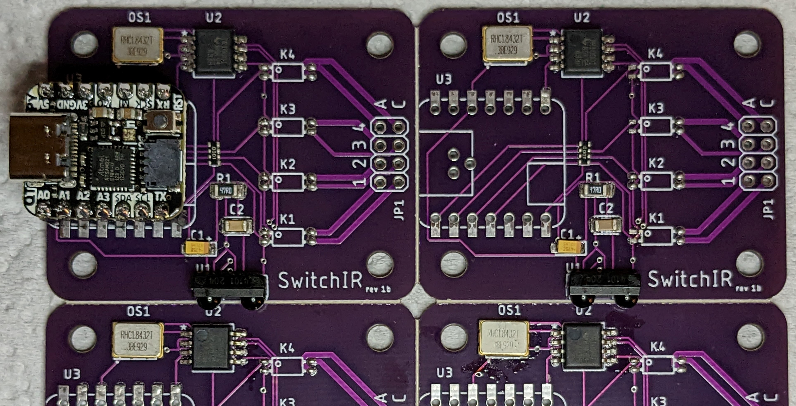

# The SwitchIR Project

## Introduction

Provides the ability to operate relays or send an IR signal in response to a signal received from:

* an IR Remote
* an IR Voice assistant
* a USB connected PC
* Wi-Fi
* or I2C (via Qwiic/STEMMA QT connector).

The use of an IR transceiver & encoder/decoder will allow the MCU to learn and transmit IR codes. The input channels are bi-directional as well allowing for an appropriate response to be returned.

## Status

|    Date    | Status                                                       |
| :--------: | ------------------------------------------------------------ |
| 2022-11-01 | Replacement oscillators are on order (and more QT Pys and headers). |
| 2022-10-31 | Boards are in, (1) panel partially populated and under test. |
| 2022-10-29 | Parts are here, boards are on their way from China.          |
| 2022-10-26 | Rev 1b boards ordered. Order for passives is pending.        |
| 2022-10-25 | Reworking defective transceiver library part and added passives (finally). |
| 2022-10-25 | Rev 1a ~~boards and~~ parts have been ordered.               |

The full complement of Eagle and Gerber files (for PCB fabrication) will be provided after proof-of-concept.

### Testing Status:

**2022-11-01**

In lieu of an oscillator that fits, a function generator was used to provide1.8432MHz timing to the encoder/decoder IC. Remote IR signals were received and are being parsed. It is not obvious that messages transmitted by the MCU are being output by the IR transceiver. The operation IR remotes is visible via my cell phone camera and other CCD devices. It's possible that it's a soldering issue - I'll know more when I get the new hardware. I'm eager to get these boards fab'ed with pick & place equipment.

---

**2022-10-31**

One panel of four boards is populated, sans relays and QT Py SAMD21 MCUs. Only one board has a MCU right now. More headers and QT Pys are on order.

At the moment the encoder/decoder is not getting a clock input from the oscillator. I'll get 3V/GND to the other boards and see if it's a solder rework issue or a chip orientation issue. There is no obvious marking except maybe a modified pad 1 which doesn't match the datasheet.

Transmitted data (serial and IR) is showing up at the encoder/decoder's input pins.

**Conclusion:**

An incorrect prototype footprint was used. A replacement is being ordered that will fit. Future production revisions will revert to the cheaper Ralton.

## ToDo List

* Put a cutout in the board to facilitate the addition of SPI Flash memory to the QT Py when mounted via  castellated pads.
* Route IR_rx data line to an interrupt capable pin on the MCU.
* Add 1µF decoupling caps for encoder/decoder.
* Maybe add some test points for access to inaccessible pads.
* Poll for larger pitch screw terminals.
* Determine if flyback diodes will be required for inductive loads across the relay contacts.

## Notes

1. Contact tracks for K2 and K3 are rated for 1.5A to reduce the width (to 20mil) to allow for routing to the far pins. A second bottom layer track could be added if needed.

## Parts List

|        | Component                                                    | Quantity | Unit cost @1 board | Unit cost @ 20 boards | $ / bd (@1 bd) | $ / bd (@20 bds) |
| :----: | ------------------------------------------------------------ | :------: | :----------------: | :-------------------: | :------------: | ---------------- |
|   U1   | [IR Transceiver](https://www.digikey.com/short/1355hrb3)     |    1     |       $5.62        |         $5.05         |     $5.62      | $5.05            |
|   U2   | [IR Encoder/Decoder](https://www.digikey.com/short/p2qnwtz0) |    1     |       $2.65        |        $2.382         |     $2.65      | $2.38            |
|  OS1   | [Oscillator](https://www.digikey.com/short/m8qd5z0f) for Rev 1a |    1     |       $1.79        |        $1.709         |     $1.79      | $1.709           |
|  OS1   | [Oscillator](https://www.digikey.com/short/chp5z3nb) (future?) |    1     |       $1.07        |        $0.946         |    ()$1.07)    | ()$0.95)         |
| K1-K4  | 2A SS [Relays](https://www.digikey.com/short/c07nbzqb)       |    4     |       $1.85        |        $1.232         |      7.40      | $4.93            |
|   C1   | 16V 47µF 1206 tantalum [capacitor](https://www.digikey.com/short/nt979437) |    1     |       $0.36        |        $0.249         |     $0.36      | $0.25            |
|   C2   | 16V 0.1µF 1206 ceramic [capacitor](https://www.digikey.com/short/2hbqb9fq) |    1     |       $0.11        |        $0.076         |     $0.11      | $0.08            |
|   R1   | 47Ω 1206 [resistor](https://www.digikey.com/short/h57hp7z4)  |    1     |       $0.10        |        $0.032         |     $0.10      | $0.03            |
|  RN1   | [resistor array](https://www.digikey.com/short/81f2wp7h) 4@100Ω 1206 |    1     |       $0.10        |        $0.087         |     $0.10      | $0.09            |
|   U3   | MCU - Adafruit QT Py                                         |    1     |                    |                       |                |                  |
| U3-hdr | [Header](https://www.digikey.com/short/92q9jh8r) 7POS Gold (**optional**) |    2     |       $0.61        |        $0.532         |    ()$1.06)    | ()$1.22)         |
|  JP1   | [Header](https://www.digikey.com/short/9pz3w55d) 2x4 (**optional**) |    1     |      ($1.34)       |       ($1.182)        |    ($1.34)     | ($1.182)         |
|        | **Total**                                                    |          |                    |                       | ~~**$17.41**~~ | ~~**$13.75**~~   |

Digi-Key (US) Component pricing as of 2022-10-26.

Pricing for (20) boards is based on (5) 2x2 panels. Total pricing for some components can be further reduced by ordering (25) units.

## Components

### IR Receiver/Transceiver

[D-K Search](https://www.digikey.com/short/qn58m0mh)

**Candidates**:

* Vishay [TFDU4101](https://www.digikey.com/short/vzrt1tnq) [datasheet](https://www.vishay.com/docs/81288/tfdu4101.pdf)

### IR Encoder/Decoder

[D-K Search](https://www.digikey.com/short/2fjh0cfm)

**Candidates**:

* TI [TIR1000IPS](https://www.digikey.com/short/4tt0fcq9) [datasheet](https://www.ti.com/lit/ds/symlink/tir1000.pdf?HQS=dis-dk-null-digikeymode-dsf-pf-null-wwe&ts=1665909863182&ref_url=https%253A%252F%252Fwww.ti.com%252Fgeneral%252Fdocs%252Fsuppproductinfo.tsp%253FdistId%253D10%2526gotoUrl%253Dhttps%253A%252F%252Fwww.ti.com%252Flit%252Fgpn%252Ftir1000)

mockup: Vishay TFDU4101 (Mouser) [datasheet](https://www.mouser.com/datasheet/2/427/tfdu4101-1766841.pdf)

### Oscillator

[Ralton 1.8432 MHz](https://www.digikey.com/short/88tr2mvc) [Datasheet](https://www.raltron.com/webproducts/specs/CLOCK_OSCILLATOR/CO4305-1.8432-EXT-T-TR.pdf)

Replaced by the Abracon LLC ASFL1-1.8432MHZ-L-T due to fitment issues for Rev 1a.

### Solid-State Relays

**Candidates**:

* Toshiba [TLP241A](https://www.digikey.com/short/n23jdcpf), (1) Form-A SPST [datasheet](https://toshiba.semicon-storage.com/info/TLP241A_datasheet_en_20200217.pdf?did=14237&prodName=TLP241A)

  * Contacts: 40V **2A**

  * LED trigger: 3mA max, Vf=1.1/1.27/1.4V

### MCU

**Candidates**:

* QT Py [search](https://www.adafruit.com/?q=qt+py&sort=BestMatch)
* ~~Itsy Bitsy~~

## Board

**Eagle**:

**Unit under test**:

## Enclosure

[README file](hardware/enclosure/README.md) in hardware/enclosure/

