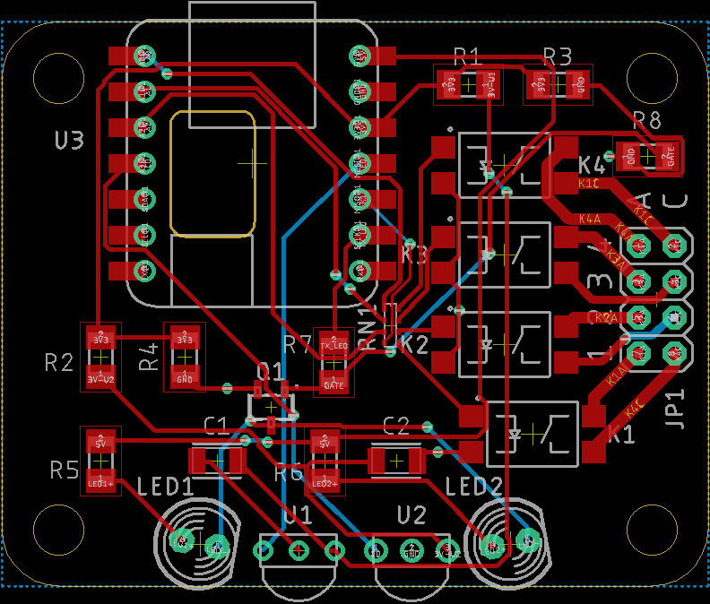

# The SwitchIR Project

## Introduction

Provides the ability to operate relays or send an IR signal in response to a signal received from:

* an IR Remote
* an IR Voice assistant
* a USB connected PC
* Wi-Fi
* or Qwiic/STEMMA QT.

The use of an IR transceiver & decoder will allow the MCU to learn and transmit IR codes as well.

## Status

|    Date    | Status                                                       |
| :--------: | ------------------------------------------------------------ |
| 2022-10-25 | Boards are on order. A Digi-Key parts order is pending (site issues). |

The full complement of Eagle and Gerber files (for PCB fabrication) will be provided after proof-of-concept.

## ToDo List

* Determine if flyback diodes will be required for inductive loads across relay contacts.

## Components

### IR Receiver/Transceiver

[D-K Search](https://www.digikey.com/short/qn58m0mh)

**Candidates**:

* Vishay [TFDU4101](https://www.digikey.com/short/vzrt1tnq) [datasheet](https://www.vishay.com/docs/81288/tfdu4101.pdf)

### IR Encoder/Decoder

[D-K Search](https://www.digikey.com/short/2fjh0cfm)

**Candidates**:

* TI [TIR1000IPS](https://www.digikey.com/short/4tt0fcq9) [datasheet](https://www.ti.com/lit/ds/symlink/tir1000.pdf?HQS=dis-dk-null-digikeymode-dsf-pf-null-wwe&ts=1665909863182&ref_url=https%253A%252F%252Fwww.ti.com%252Fgeneral%252Fdocs%252Fsuppproductinfo.tsp%253FdistId%253D10%2526gotoUrl%253Dhttps%253A%252F%252Fwww.ti.com%252Flit%252Fgpn%252Ftir1000)

mockup: Vishay TFDU4101 (Mouser) [datasheet](https://www.mouser.com/datasheet/2/427/tfdu4101-1766841.pdf)

### Oscillator

[Ralton 1.8432 MHz](https://www.digikey.com/short/88tr2mvc) [Datasheet](https://www.raltron.com/webproducts/specs/CLOCK_OSCILLATOR/CO4305-1.8432-EXT-T-TR.pdf)

### Solid-State Relays

**Candidates**:

* Toshiba [TLP241A](https://www.digikey.com/short/n23jdcpf), (1) Form-A SPST [datasheet](https://toshiba.semicon-storage.com/info/TLP241A_datasheet_en_20200217.pdf?did=14237&prodName=TLP241A)

  * Contacts: 40V **2A**

  * LED trigger: 3mA max, Vf=1.1/1.27/1.4V

### MCU

**Candidates**:

* QT Py [search](https://www.adafruit.com/?q=qt+py&sort=BestMatch)
* ~~Itsy Bitsy~~

## Parts List

| Component                                                    | Quantity | Price each |   Total    | Notes |
| ------------------------------------------------------------ | :------: | :--------: | :--------: | ----- |
| [IR Transceiver](https://www.digikey.com/short/1355hrb3)     |    1     |   $5.62    |   $5.62    |       |
| [IR Encoder/Decoder](https://www.digikey.com/short/p2qnwtz0) |    1     |   $2.65    |   $2.65    |       |
| [Oscillator](https://www.digikey.com/short/chp5z3nb)         |    1     |   $1.07    |   $1.07    |       |
| [Relays](https://www.digikey.com/short/c07nbzqb)             |    4     |   $1.85    |    7.40    |       |
| MCU                                                          |    1     |            |            |       |
|                                                              |          |            |            |       |
| **Total**                                                    |          |            | **$16.74** |       |

## Board

