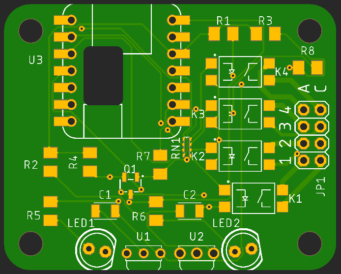

# The SwitchIR Project

## Introduction

Provides the ability to operate relays or send an IR signal in response to a signal received from:

* an IR Remote
* an IR Voice assistant
* a USB connected PC
* Wi-Fi
* or I2C (via Qwiic/STEMMA QT connector).

The use of an IR transceiver & encoder/decoder will allow the MCU to learn and transmit IR codes. The input channels are bi-directional as well allowing for an appropriate response to be returned.

## Status

|    Date    | Status                                                       |
| :--------: | ------------------------------------------------------------ |
| 2022-11-24 | Rev 2b boards have been ordered. Cleaned up this page. Pricing & spreadsheet. |
| 2022-11-23 | Fixed the relay footprints, changed the caps to SMD, moved the carrier detector input to pin 3 (IRLib default), changed RN1 value. Parts list update pending. |
| 2022-11-23 | Found out this morning that the MOSFET lib part was totally fubar. Thanks  "Ultra" Librarian. I spend more time fixing imported library parts. |
| 2022-11-22 | Built a board and working with IRLib2 examples & (5) remotes. Waiting for QT Py SPI Flash chips. |
| 2022-11-21 | Created a cutout for QT Py Flash memory. The boards arrive today. |
| 2022-11-04 | Success with IRLib2.                                         |

The full complement of Eagle and Gerber files (for PCB fabrication) will be provided after proof-of-concept.

### Testing Status:

**2022-11-23**

No transmit for me. The imported MOSFET's connections were totally botched (3 for 3).

Tested QT Py SAMD21 current output. The relays like 10mA and drop GPIO output to 2.90V. That changes the dropping resistor to 163Ω - the next closest was 150Ω.

**2022-11-22**

I'm getting meaningful results from Chris' example sketches dump, analyze, & freq.ino - and sorting out various results from (5) remotes. Throw in a little Perl code to parse the dump results just for fun. Next come the sending examples, then capture and save to flash memory.

## ToDo List

* ~~Move the carrier detector output to pin 3 to eliminate a IRLib code change~~.
* ~~Put a cutout in the board to facilitate the addition of SPI Flash memory to the QT Py when mounted via  castellated pad~~s.
* ~~SMD Caps~~.
* ~~Fix the SSRelay footprints~~.
* Move the IR LEDs back. After bending them 90° they protrude forward a bit much. 
* Consider adding I2C UART for HC-05 Bluetooth module. USE my Qwiic/STEMMA QT module.
* Add some test points for access to inaccessible pads.
* Poll for larger pitch screw terminals.
* Determine if flyback diodes will be required for inductive loads across the relay contacts.

## Notes

1. The ItsyBitsy may be an option since it has SPI Flash memory for storing codes and macros and there is a Bluetooth LE model.
1. I plan to add solder holes for 4mm pitch quick connect [wire terminals](https://www.digikey.com/short/wv4jwn28).
1. Contact tracks for K2 and K3 are rated for 1.5A to reduce the width (to 20mil) to allow for routing to the far pins. A second bottom layer track could be added if needed.
1. The QT Py accesses the SPI FLASH chip via **SPI1** with chip select pin **17**, so there's no interference with our use of the external SPI pins.
1. For HC-05 Bluetooth my Qwiic/STEMMA QT module can be used.

## 

## References

Chris Young's Ultimate Remote and IR library.

* [IRLib2](https://github.com/cyborg5/IRLib2)
* Ultimate Remote:
  * GitHub [repo](https://github.com/cyborg5/Ultimate-Remote)
  * [Building Guide](https://learn.adafruit.com/building-the-assistive-technology-ultimate-remote/) hosted on Adafruit Learn
  * [Demo](https://www.youtube.com/watch?v=zmK1W0HwCh0&ab_channel=ChrisYoung) video
  * Video intro on [ATMakers](http://atmakers.org/2021/08/ultimate-remote-chris-young-tour/) and [YouTube](https://www.youtube.com/watch?v=doWbv29P5To&ab_channel=ATMakers)

hi-fi-remote.com's IRP and JP1 project

* IRP (IR Remote Protocol description notation)
  * John Long's [Interpreting Decoded IR Signals](http://www.hifi-remote.com/johnsfine/DecodeIR.html) (Listings and details)
  * Brief and Incomplete [Guide](http://www.hifi-remote.com/wiki/index.php?title=Brief_and_incomplete_guide_to_reading_IRP) to Reading IRP
  * Graham Dixon's [IRP Notation](http://hifi-remote.com/wiki/index.php?title=IRP_Notation)
  * IRP Parser Transmogrifier on [GitHub](https://github.com/bengtmartensson/IrpTransmogrifier) & [HARCToolbox](http://www.harctoolbox.org/IrpTransmogrifier.html) "Parser for IRP notation protocols, with rendering, code generation, recognition applications."
* JP1 Remote Project
  * [History](http://www.hifi-remote.com/wiki/index.php/The_History_of_the_JP1_Project) with links to other interesting projects
  * JP1 [Main](http://www.hifi-remote.com/wiki/index.php/Main_Page) Page
  * The One For All Universal IR remotes which are the focus of the JP1 effort, given the JP1 label on the battery connector. Model [URC3680](https://www.amazon.com/dp/B09ZHM3D9R/) on Amazon.

Other resources to investigate:

* [irdb](https://github.com/probonopd/irdb)
* [Arduino IR Remote](https://github.com/Arduino-IRremote/Arduino-IRremote)

## Parts List

|  Device   | Component                                                    |  Quantity   | Unit cost @1 board | Unit cost @ 20 boards | $ / bd (@1 bd) | $ / bd (@20 bds) |
| :-------: | ------------------------------------------------------------ | :---------: | :----------------: | :-------------------: | :------------: | ---------------- |
|  **IR**   | **Send/Receive**                                             | **Section** |                    |                       |                |                  |
|    U1     | IR Envelope Detector ([TSOP53438](https://www.digikey.com/short/wt54trr8)) |      1      |       $1.22        |        $0.772         |     $1.22      | $0.77            |
|  U1 alt   | IR Envelope Detector ([TSOP53538](https://www.digikey.com/short/c2m90j2p)) |      1      |      ()$1.37)      |       ()$1.072)       |    ()$1.37)    | ()$1.07)         |
|    U2     | IR Carrier Detector ([TSMP58000](https://www.digikey.com/short/z079p85v)) |      1      |       $1.23        |        $0.965         |     $1.23      | $0.97            |
|    D1     | IR [Transmitter](https://www.adafruit.com/product/387)       |      2      |       $0.75        |         $0.68         |     $1.50      | $0.64            |
|    Q1     | [MOSFET](https://www.digikey.com/short/qvnjfq3w) or [alt](https://www.digikey.com/short/5jzjq90m) |      1      |       $0.37        |        $0.281         |     $0.37      | $0.28            |
| **Relay** | **Section**                                                  |             |                    |                       |                |                  |
|    RN1    | [resistor array](https://www.digikey.com/short/tt50jn33) 4@150Ω 1206 |      1      |       $0.17        |        $0.147         |     $0.17      | $0.15            |
|   K1-K4   | 2A SS [Relays](https://www.digikey.com/short/w7qrtp8h)       |      4      |       $1.85        |        $1.232         |      7.40      | $4.93            |
| **MISC**. | **Section**                                                  |             |                    |                       |                |                  |
|   C1 C2   | [Cap](https://www.digikey.com/short/v734w1qh) 4.7µF Tant 10% 10V 1206 |      2      |       $0.35        |        $0.244         |     $0.70      | $0.49            |
| R1 R2 R7  | [Res](https://www.digikey.com/short/4qhq3d02) 100Ω 1% 1206   |      3      |       $0.10        |        $0.032         |     $0.30      | $0.10            |
|   R3 R4   | [Res](https://www.digikey.com/short/tn7m034f) 4.7kΩ 1% 1206  |      2      |       $0.10        |        $0.032         |     $0.20      | $0.06            |
|   R5 R6   | [Res](https://www.digikey.com/short/84vd337r) 33Ω 1% 1203    |      2      |       $0.10        |        $0.065         |     $0.20      | $0.13            |
|    R8     | [Res](https://www.digikey.com/short/tm2btwjj) 1kΩ 1% 1203    |      1      |       $0.10        |        $0.025         |     $0.10      | $0.03            |
|  **MCU**  | **Headers**                                                  |    **&**    |   **Terminals**    |                       |                |                  |
|    U3     | MCU - Adafruit QT Py  [DK](https://www.digikey.com/short/vn39f2qr) [AF](https://www.adafruit.com/product/4600) |      1      |       $7.50        |         $7.50         |     $7.50      | $7.50            |
|  U3-hdr   | MCU [Header](https://www.digikey.com/short/d52zp1m5) 7POS 4.57mm (**optional, #1**) |      2      |      ($1.11)       |       ($0.9152)       |    ($2.22)     | ($1.83)          |
|  U3-hdr   | MCU [Header](https://www.digikey.com/short/92q9jh8r) 7POS 8.51mm Gold (**optional, #1**) |      2      |       $0.61        |        $0.532         |    ($1.22)     | ($1.06)          |
| SPI FLASH | [FLASH](https://www.adafruit.com/product/4763) IC (**optional**) |      1      |      ($1.25)       |        ($1.13)        |    ($1.25)     | ($1.13)          |
|    J1     | Relay [Header](https://www.digikey.com/short/9pz3w55d) 2x4 (**optional**) |      1      |      ($1.34)       |       ($1.182)        |    ($1.34)     | ($1.18)          |
|    J1     | Screw Terminals (optional)                                   |             |                    |                       |                |                  |
|           | **Total**                                                    |             |                    |                       |   **$20.89**   | **$16.03**       |

Digi-Key (US) Component pricing as of 2022-11-xx.

Pricing for (20) boards is based on (5) 2x2 panels. Price breaks for some components are at (5) or (25) units.

**#1** MCU can use Castellated mounting even with SPI Flash attached.

## Pricing

Pricing for **unassembled boards** would be about $1.70 each with no parts. So about $23.00/board plus parts and kit shipping for DIY SMD & Through-hole assembly. As of 2022-11-24.

Pricing for SMD assembled boards would be roughly $18.50 plus shipping for through-hole parts (divided among 20 boards or more) and DIY Through-hole kit shipping. This is a ***very*** rough estimate as engineering, shipping, and coupon availability vary widely. But generally, component cost is less than I pay before shipping. SMD component shipping cost is bundled with board shipping cost which makes it a minimal cost item. As of 2022-11-24.

This does not consider costs for optional board components (headers, terminals, SPI FLASH memory), an enclosure, cables, or power supply.

See the component pricing spreadsheet (.ods) for the most current pricing.

## Components

### IR Receiver, Envelope Detector

[D-K Search](https://www.digikey.com/short/44rdjth4)

Vishay [TSOP53438](https://www.digikey.com/short/1jd1m5vc) - 238 438 preferred for RC-5 RC-6 Panasonic NEC Sharp r-step Thomson RCA

Vishay [TSOP53538](https://www.digikey.com/short/1hjpj9q8) 138 338 538 preferred for MCIR Mitsubishi RECS-80 Code r-map XMP-1, XMP-2 RCMM

Adafruit #[157](https://www.adafruit.com/product/157) (Vishay TSOP38238 - older series)

0.60 x 0.30mm, 2.54mm pitch mounting

### IR Receiver, Carrier Detector

* Vishay [TSMP58000](https://www.digikey.com/short/052d7012) (end-of-life) [datasheeet](https://www.vishay.com/docs/82485/tsmp58000.pdf)
  * 0.70 x 0.50mm, 2.54mm pitch mounting

* [TSMP98000](https://www.digikey.com/short/r579ptn3) (new) [datasheet](https://www.vishay.com/docs/82908/tsmp98000.pdf) - no pricing

### IR Transmitter

Adafruit #[387](https://www.adafruit.com/product/387) [datasheet](https://cdn-shop.adafruit.com/datasheets/IR333_A_datasheet.pdf)

​	5mm 2.54mm pitch 0.5mm dia / 20° @20mA

| Current | Conditions | Vf Typ (V) | Vf Max (V) |
| :-----: | :--------: | :--------: | :--------: |
|  20mA   |     -      |    1.2     |    1.5     |
|  100mA  |  100µs 1%  |    1.4     |    1.8     |
|  1.0A   |    " "     |    2.6     |    4.0     |

**Dropping Resistor**: (5V - 1.6Vf) / 100mA = 34Ω   @ 100mA (x 2, hence 5V rail)

### Solid-State Relays

**Candidates**:

* Toshiba [TLP241A](https://www.digikey.com/short/n23jdcpf), (1) Form-A SPST [datasheet](https://toshiba.semicon-storage.com/info/TLP241A_datasheet_en_20200217.pdf?did=14237&prodName=TLP241A)

  * Contacts: 40V **2A**

  * LED trigger: 3mA max, Vf=1.1/1.27/1.4V

#### MOSFET

Rohm [RJK005N03FRAT146](https://www.digikey.com/short/qvnjfq3w) [datasheet](https://media.digikey.com/pdf/Data%20Sheets/Rohm%20PDFs/RJK005N03FRA_DS.pdf)

### Passives

#### C1 C2: 4.7µF tantalum cap 10V 10% x 2

​	Kemet [ESK475M016AC3AA](https://www.digikey.com/short/2bzhn052) 0.55 / 0.291

#### R1 R2: 100Ω 5% 1/4W 1206 resistor

​	Stackpole [RMCF1206JT100R](https://www.digikey.com/short/fhrwjb7f) 0.10 / 0..25

#### R3 R3: 4.7kΩ 5% 1/4W 1206

​	Stackpole [RMCF1206FT4K70](https://www.digikey.com/short/j2bbwfmh) 0.10 / 0.032

#### R5 R6: 33Ω 1% 1/4W 1206

​	Yageo [RC1206FR](https://www.digikey.com/short/n2cqt5dm)-0733RL 0.10 / 0.066

### MCU

**Candidates**:

* QT Py [search](https://www.adafruit.com/?q=qt+py&sort=BestMatch)
* ItsyBitsy
  * M0 Express #[3727](https://www.adafruit.com/product/3727) $11.95 48MHz / 2MB SPI Flash / red and RGB DotStar LEDs
  * nRF52840 **BLE** #[4481](https://www.adafruit.com/product/4481) $19.95 64MHz /  red mini DotStar RGB LEDs
  * SAMD51 #[3800](https://www.adafruit.com/product/3800) $14.95 120MHz / red and RGB DotStar LEDs
  * RP2040 #[3888](https://www.adafruit.com/product/4888) Not Arduino IDE compatible yet.

## Board

**Eagle**:

## Enclosure

[README file](hardware/enclosure/README.md) in hardware/enclosure/.
