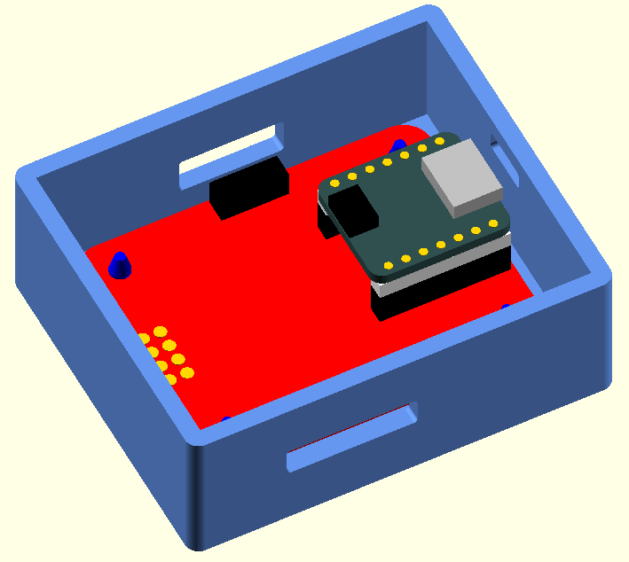
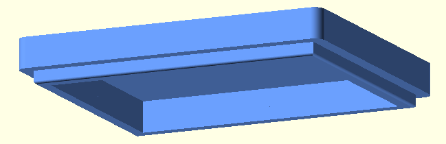

## SwitchIR Enclosure

This folder contains the base and lid for the SwitchIR board enclosure. It was designed with OpenSCAD.

I've not received the boards yet so fitment has **not been verified**.

My files may contain Boolean definitions that generate parts to be installed (like boards) in order to gain insight into fitment, etc.

My narrow OpenSCAD file code formatting matches my editor window. Formatting of the code is a product of the OpenSCAD learning process for me. My apologies should it offend you.

## Status

|    Date    | Status               |
| :--------: | -------------------- |
| 2022-10-30 | Preliminary release. |

## Files

| File                          | Description                                                  |
| ----------------------------- | ------------------------------------------------------------ |
| SwitchIR_base_v3.scad         | OpenSCAD file for the base box.                              |
| SwitchIR_lid_v3.scad          | OpenSCAD file for the box lid.                               |
| common.scad                   | Dimensions, functions, and modules common to multiple parts. |
| SwitchIR_base_v3.stl          | File for 3-D printing.                                       |
| SwitchIR_lid_v3.stl           | File for 3-D printing.                                       |
| SwitchIR_base_with_boards.stl | File for viewing board layout, **not for printing**.         |
| mylibs/components.scad        | library for PCB components. Copy to local dir or OpenSCAD/libraries. |
| mylibs/mcus.scad              | library for microcontrollers. Copy to local dir or OpenSCAD/libraries. |

### Images

The base shows the SwitchIR board installed with the QT Py module. There's a window for the USB-C cable and the IR optical components.

